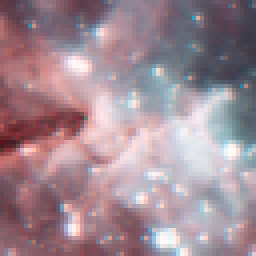
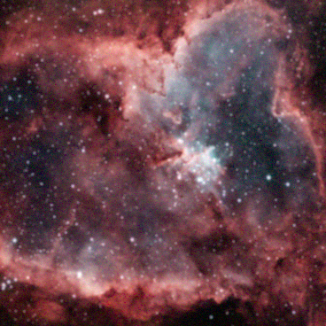
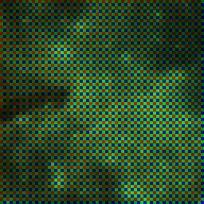
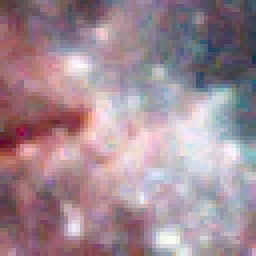
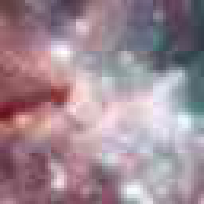

# degradr
Python library for realistically degrading images.
Work in progress, I will add more documentation when having something to show for.
  
The set of matrices for conversions between the camera and sRGB color space was derived from the LibRaw library (https://github.com/LibRaw/LibRaw).

**The applied steps are as follows (assuming the image is already in the camera color space):**
<ol>
<li>Convolve by random blur kernel (a combination of defocus blur, gaussian blur, PSFs generated from Zernike polynomials to model the lens aberrations, chromatic aberration)</li>
<li>Color filter array (in practice applied directly before the demosaicing for simplicity, but this doesn't affect the output)</li>
<li>Poison noise</li>
<li>Gain</li>
<li>Read Noise</li>
<li>Quantization</li>
<li>Camera white balance</li>
<li>Demosaicing (3 different methods using the Intel Performance Primitives)</li>
<li>Color space transformation (from white balance corrected camera color space to sRGB)</li>
<li>JPEG Compression</li>
</ol>
  

**Examples:**
| Input |  |
|:-:|-|
| Blur |  | 
| Blur   Noise |  |
| Blur   Noise   CFA |  |
| Blur   Noise   CFA   AHD Demosaicing |  |
| Blur   Noise   CFA   AHD Demosaicing   JPEG Compression |  |
