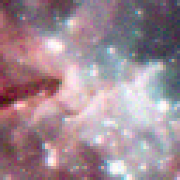

# degradr
Python library for realistically degrading images.
Work in progress, I will add more documentation when having something to show for.

| Input | Blur | Blur + Noise | Blur + Noise + CFA |
|-------|------|--------------|--------------------|
|  |  |  |  |
