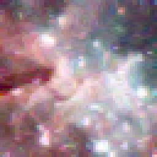
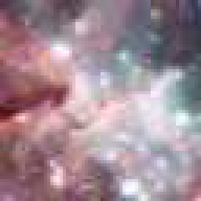

# degradr
Python library for realistically degrading images. There is still some work in progress, but at the current state it should already be usable.

For building the Intel Integrated Performance Primitives Python wrapper, which is needed for demosaicing, please download the IPP libraries (or the whole oneAPI Base Toolkit). Then adapt the additional library and include directories of the Visual Studio project to point to the targeted python version and compile as a Release x64 library. Copy the PyIPP.pyd file somewhere into your pythonpath / adapt the pythonpath. 
When running into trouble, [this guide](https://learn.microsoft.com/en-us/visualstudio/python/working-with-c-cpp-python-in-visual-studio?view=vs-2022) might help which is what I used for creating the wrapper library. If building on Linux, you're unfortunately on your own, but it should absolutely be doable as well.

The set of matrices for conversions between the camera and sRGB color space was derived from the [LibRaw](https://github.com/LibRaw/LibRaw) library and does NOT fall under the license of this project.

A sample usage of the library can be found in the Test.py script, which applies all steps necessary for degrading a "perfect" image.
The applied steps are as follows (assuming the image is already in the camera color space):
<ol>
<li>Convert the input image to the assumed camera color space if needed.</li>
<li>Convolve by random blur kernel. (a combination of defocus blur, gaussian blur, PSFs generated from Zernike polynomials to model the lens aberrations, chromatic aberration)</li>
<li>Color filter array (in practice applied directly before the demosaicing for simplicity, but this doesn't affect the output)</li>
<li>Poison noise</li>
<li>Gain</li>
<li>Read Noise</li>
<li>Quantization</li>
<li>Camera white balance</li>
<li>Demosaicing (3 different methods using the Intel Integrated Performance Primitives)</li>
<li>Color space transformation (from white balance corrected camera color space to sRGB)</li>
<li>JPEG Compression</li>
</ol>
  

**Examples:**
| Input |  |
|:-:|-|
| **Blur** |  | 
| Blur   **Noise** |  |
| Blur   Noise   **CFA** |  |
| Blur   Noise   CFA   **AHD Demosaicing** |  |
| Blur   Noise   CFA   AHD Demosaicing   **JPEG Compression** |  |
